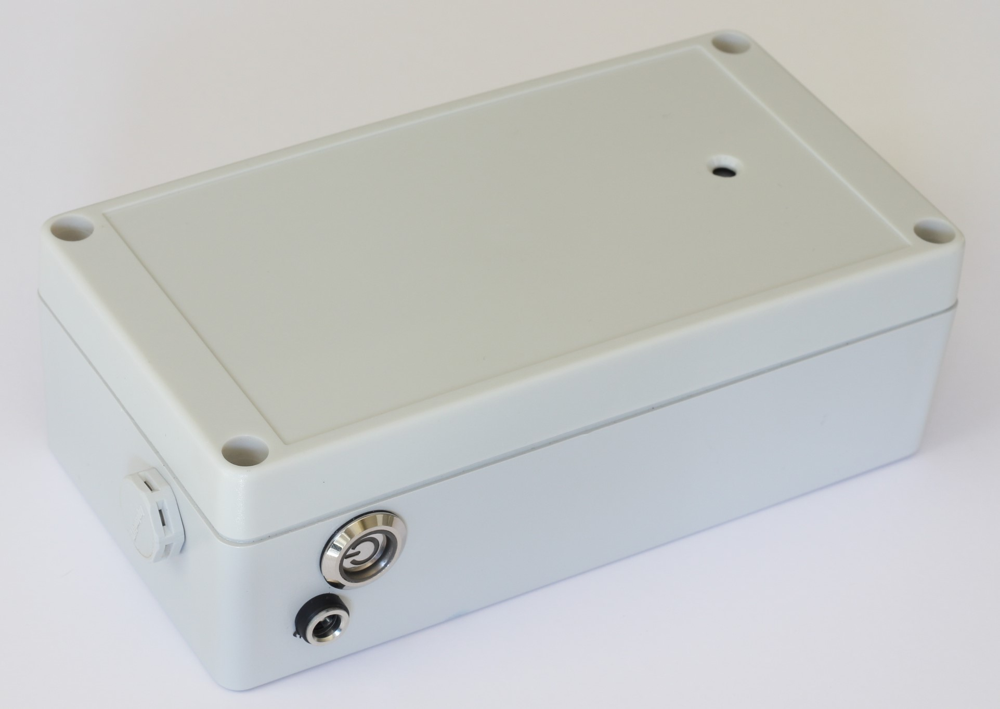
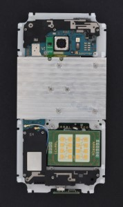
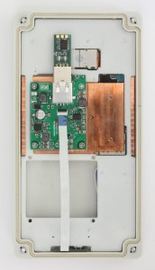
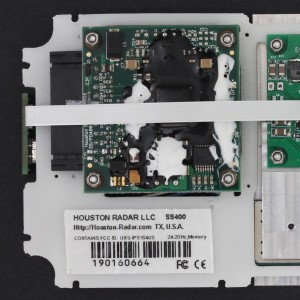
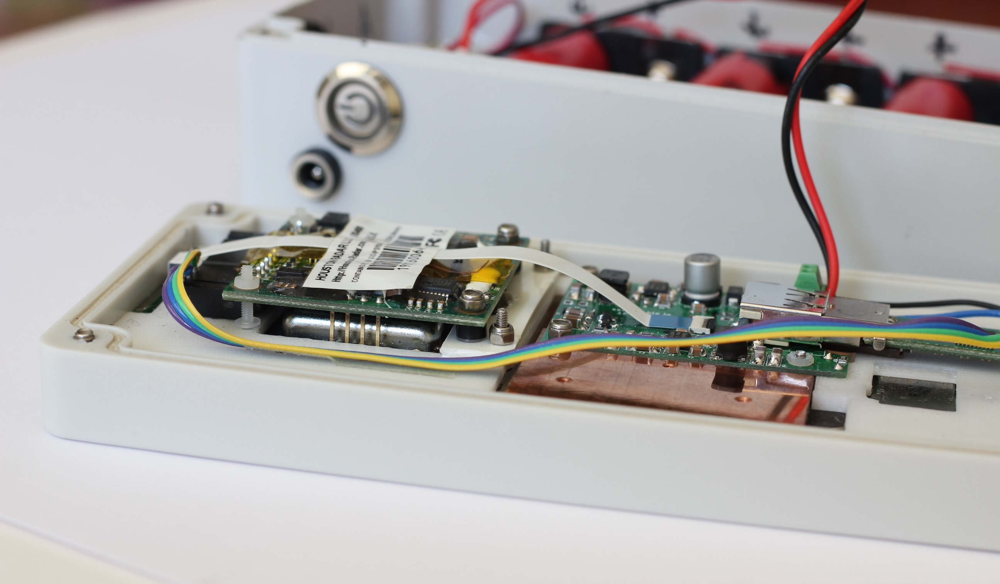

# Sensorable Open Source Camera
### Electronics and assembly

Sensorable camera is a low power edge computer for smart applications with limited power and bandwidth.
It is based on Samsung G935F smartphone board with auxiliary chassis and electronics.

**Applications:**
* outdoor security
* remote site monitoring
* beach / nature cams
* traffic monitoring
* vehicle counting
* ALPR / ANPR
* speed control and monitoring

## Main components
* G935F board with a rear camera and antennas
* [custom G935f chassis](https://github.com/sensorable/g935-enclosure)
* [Hammonds IP65 enclosure](https://www.hammfg.com/part/RP1170)
* [auxiliary PSU](https://github.com/sensorable/g935-electronics/tree/master/psu)
* [power](https://github.com/sensorable/g935-electronics/tree/master/pwr-conn) and [USB connectors](https://github.com/sensorable/g935-electronics/tree/master/usb-conn)

The camera can be assembled, programmed, tested and deployed by a sufficiently skilled technician.  

See _BOM-combined.csv_ for the full list of parts.

## Packaging options

* Chassis only for OEM embedding: 155mm x 75mm x 15mm
* Unsealed enclosure for OEM embedding: 165mm x 86mm x 20mm
* Sealed enclosure for external use: 165mm x 86mm x 56mm

The sealed enclosure may include an optional battery pack. See https://github.com/sensorable/batt-pack for more info.

 

## Auxiliary components

The chassis has mounting options for a few auxiliary components. They can also be connected externally via USB or RS232.

* Built-in Houston-Radar SS400
* Built-in generic OEM radar
* USB/RS232 adapter
* External Houston-Radar
* External AGD radar

## Ordering and assembly

This is only a high level overview to give you an idea what's involved. We recommend getting in touch with us to help you with your production run.

Check the combined BOM for the full list of components and recommended suppkiers. We tried to minimise the number of suppliers and use only the reputable ones: 

* **Elelctronic parts**: DigiKey
* **Fastenings**: Accu
* **PCB**: JlcPCB
* **PCBA**: JlcPCB or your local PCBA specialist

The final assembly is expected to be done in-house or by a __trusted__ local embedded systems specialist as it involves testing, loading the software and configuring the devices.

See other repositories for the mechanical (chassis) and software (ROM, tools, apps, etc).

